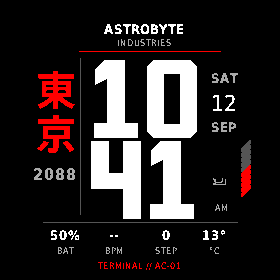
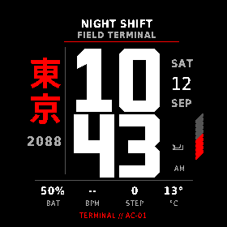

# TOKYO 2088

Native Monkey C / Connect IQ watch face for the **Garmin fēnix 8 Solar 51mm** (`fenix8solar51mm`, 280 × 280 MIP). Oversized stacked time, vertical 東京 / 2088 lettering, four restrained palettes and an identity plate you can make your own.




## Status: release 1.0.0 submitted to the Connect IQ Store

Submitted on 19 September 2026 as a paid watch face: 24-hour trial, then a one-time US$2.50 unlock through KiezelPay. Listing `cf802fe8-f538-4922-b1b0-2825e40d90c6`, app UUID `d8c8adfe21c74bdd97fa2088ac010001`, version 1.0.0. Garmin review takes up to three days. The submitted package was built from the KiezelPay integration on branch `codex/public-kiezelpay` (`public.jungle`, `manifest-public.xml`); that branch is not yet merged here. `manifest.xml` and `monkey.jungle` on this branch build the payment-free variant under a separate UUID and are not what is published. Details in [docs/store/README.md](docs/store/README.md).


- Runtime source and resources are identical to the owner-tested beta 0.1.1; the public build adds the KiezelPay wrapper, Background and Communications permissions.
- Release and native-test builds compile with no warnings on Connect IQ SDK 9.1.0. **9 native simulator test groups pass, 0 failed, 0 errors.**
- The beta was installed on the owner's actual fēnix 8 Solar 51mm through the Connect IQ app. Phone settings delivery, same-beta update retention, restart persistence and both offline font notices were confirmed on hardware.
- Store copy, screenshots, icon and hero image are prepared under [docs/store](docs/store/README.md) and [design/store](design/store/README.md).

Known limitations, stated plainly: battery use has not been measured. [Issue #1](https://github.com/astrobyte-dev/tokyo-2088/issues/1), an intermittent black screen reported on the original 0.1.0 sideload, was traced to that build skipping drawing on same-minute updates; every update now repaints the full face. The owner has worn the face continuously since 11 September 2026 with no recurrence, and a read-only inspection of the watch on 19 September found no Connect IQ error log entry for TOKYO 2088 ([evidence](docs/store/VALIDATION.md#hardware-wear-and-device-log-evidence--19-september-2026)). Product images are simulator captures with simulated data, not watch photographs.

## Features

- Time and date in the watch's local time, follow-device / 12-hour / 24-hour, optional hour leading zero.
- Battery percentage and stripe, steps, recent heart rate and Garmin cached outdoor temperature (`--` when unavailable, `OLD` after one hour).
- Palettes: Classic Red (default), Neon Cyan, Monochrome, Amber.
- Identity plate: Original (ASTROBYTE / INDUSTRIES), Custom two-line text, Manual city and subtitle, or Hidden. No GPS or automatic city lookup.
- Seconds off by default, or shown while the watch is active.
- Larger data text and decorative bottom label toggles.
- Offline DejaVu / Arev and Noto / SIL OFL font notices from the face's settings menu.

## Build and test (Windows)

```powershell
powershell.exe -NoProfile -File tools/build.ps1 release -DeveloperKey <private key .der> -OutputDir build/windows/<new folder>
powershell.exe -NoProfile -File tools/build.ps1 test    -DeveloperKey <private key .der> -OutputDir build/windows/<new folder>
powershell.exe -NoProfile -File tools/simulator.ps1 start
powershell.exe -NoProfile -File tools/simulator.ps1 test -OutputDir build/windows/<new folder>
powershell.exe -NoProfile -File tools/export-store.ps1 -DeveloperKey <private key .der> -SigningProvenance OwnerApprovedPermanent -OutputDir build/windows/store-prep/<new folder>
python tools/check-store-prep.py --iq build/windows/store-prep/<new folder>/TOKYO2088-store-prep.iq
```

Keep the private key outside the repository. Linux equivalents are in `tools/*.sh`. Always pass a fresh output folder; the default folders hold preserved artifacts.

## Documentation

- [Store release preparation, listing copy, settings, privacy, licensing, signing](docs/store/README.md)
- [Executed validation and evidence](docs/store/VALIDATION.md)
- [Device support](docs/DEVICE_SUPPORT.md) · [Design decisions](docs/DESIGN_DECISIONS.md) · [Third-party notices](THIRD_PARTY_NOTICES.md) · [Privacy](PRIVACY.md)
- Historical: [black-screen investigation](docs/BLACK_SCREEN_INVESTIGATION.md) · [Windows redraw fix](docs/WINDOWS_REDRAW_RESULTS.md) · [original brief](TOKYO_2088_BRIEF.md)
- [Production renderer](source/TokyoView.mc) · [settings](source/Settings.mc) · [data](source/Data.mc) · [font notices](source/FontNotices.mc)
- [Editable numerals](assets-src/numerals.json) · [asset generator](tools/generate_assets.py)

Other devices and automatic city detection remain deferred. The concept board in `design/reference` is reference material only, never a runtime background.
