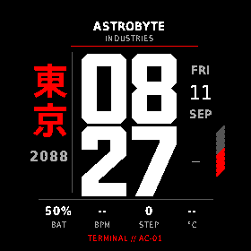
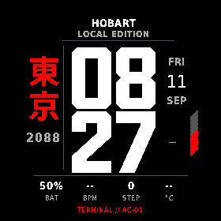

# TOKYO 2088

Native Monkey C / Connect IQ watch face for **fēnix 8 Solar 51mm (`fenix8solar51mm`), 280 × 280 MIP**. Classic Red is the default.

**Hardware defect open:** the owner reports that the installed face initially works on the fēnix 8 Solar 51mm but occasionally goes completely black, with no visible IQ error icon. Trigger, duration and recovery are unknown. Prior simulator passes do not resolve this defect. Start with [the investigation and source map](docs/BLACK_SCREEN_INVESTIGATION.md).

Device-specific debug/test/release builds and four native simulator test groups previously passed. The release transfer was verified by matching MTP readback checksum. See [handoff scope and reproduction](docs/GITHUB_HANDOFF.md) and [sanitized first install](docs/FIRST_INSTALL.md).




- Release PRG and package are preserved locally, excluded from Git; [recorded identity](docs/evidence/installed-release-build-info.json).
- [Build, Linux MTP installation and removal](docs/BUILD_AND_TEST.md)
- [Executed tests, memory measurements and limitations](docs/TEST_RESULTS.md)
- [Native captures and 4× nearest-neighbour copies](design/simulator/README.md)
- [Device support](docs/DEVICE_SUPPORT.md) · [design decisions](docs/DESIGN_DECISIONS.md)
- [Production renderer](source/TokyoView.mc) · [settings](source/Settings.mc) · [data](source/Data.mc)
- [Editable numerals](assets-src/numerals.json) · [asset generator](tools/generate_assets.py)

Preserved: huge stacked local time, vertical 東京 / 2088, red structural accents, date column, battery stripes and editable two-line identity plate. The concept board is reference material, never a runtime background. Data in simulator captures is simulated, not a physical sensor reading.

```bash
python3 tools/check_assets.py
./tools/build.sh debug
./tools/build.sh test
./tools/build.sh release
./tools/simulator.sh start       # keep open in a separate terminal
./tools/simulator.sh test
./tools/simulator.sh run-release
```

The 40 asset checks and four executed native test groups are different checks. The Garmin test launcher reports exit code 1 even when its framework reports all four passing; see the preserved raw results before interpreting automation status. Other devices and automatic city detection remain deferred. This is a hardware-test build, not a claim of production readiness.
