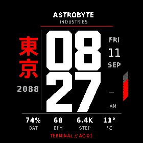
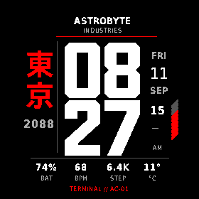

# Windows native simulator evidence

11 September 2026, Windows SDK 9.1.0, `fenix8solar51mm` API 6.0.0. These are simulator observations, not physical-watch captures. All binaries use the temporary Windows development key. [Results and limits](../../../docs/WINDOWS_REDRAW_RESULTS.md).

## Injected cleared-surface regression

Each fixture performs two production `onUpdate` calls at identical injected time, clearing the DC externally between them. No dirty invalidation occurs between those calls. The same compiled production renderer executes in both builds. This deliberately simulates loss of retained pixels; it does not claim that this exact lifecycle was observed on the watch.

| Seconds | Baseline behavior | Candidate behavior |
|---|---|---|
| Off |  |  |
| While active |  |  |

All four are unaltered **280 × 280 PNGs exported by Garmin File → Save Screen Capture**. The telemetry/time in these fixtures is injected data. Candidate captures use original identity and default device 12-hour preference; the historical 08:27 reference used 24-hour mode. Pixel comparisons therefore select the time and identity regions, excluding AM/PM and telemetry. Candidate seconds-off/on captures differ only in the seconds region.

Run `python tools/compare-redraw-captures.py` from the repository root to verify the exported pixels against these expectations and the preserved native 08:27 reference. No screenshot is rewritten by this comparison.

## Normal production rendering and power modes

| Program/mode | Evidence |
|---|---|
| Baseline debug, High Power, real simulator clock | [Unaltered Garmin 280px export](baseline-production-active.png) |
| Baseline debug, after selecting Always-Active | [280px window crop](baseline-production-low-power-window-crop.png), [original window screenshot](baseline-low-power-window.jpg) |
| Candidate release, explicitly selected High Power | [280px window crop](candidate-production-active-window-crop.png), [original window screenshot](candidate-active-window.jpg) |
| Candidate release, after selecting Always-Active | [Unaltered Garmin 280px export](candidate-production-low-power.png) |

The two files named `window-crop` are crops of actual computer-use JPEG screenshots, **not lossless Garmin screen exports**. Cropping uses the observed device screen origin `(78,180)` and its package-defined 280px size; no scaling, recoloring, masking or reconstructed graphics. Watch-skin corners remain visible in those square crops. They support visual power-mode inspection and are excluded from exact-pixel comparisons. The source windows are retained to show provenance. The normal production face uses simulator telemetry; it is not a sensor reading from the connected watch.

The candidate remained visible through observed minute changes. Midnight/month/year checks belong to the deterministic native suite, not these normal-clock images. See [production release memory screenshot](../../../docs/evidence/windows-release-memory.jpg) and [viewer text](../../../docs/evidence/windows-release-memory.txt): 17.8 kB current, 19.4 kB peak at the captured sample. No physical battery claim is made.
